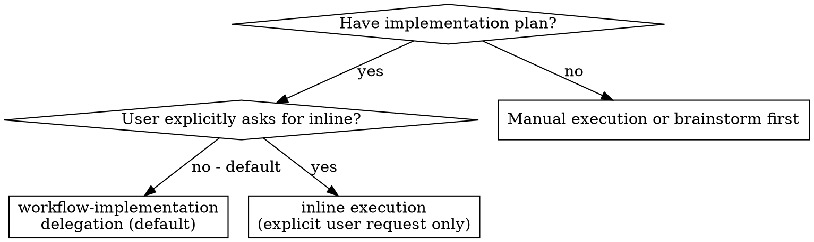

# Implementation Execution

Define execution discipline for implementation controllers: isolated task context, spec compliance review before code quality review, and verification before completion.

**Why subagents:** You delegate tasks to specialized agents with isolated context. By precisely crafting their instructions and context, you ensure they stay focused and succeed at their task. They should never inherit your session's context or history; you construct exactly what they need. This also preserves your own context for coordination work.

**Core principle:** Fresh `implement-task` worker per task + two-stage review (spec then quality) = high quality, fast iteration

**Continuous execution:** Do not pause to check in with your human partner between tasks. Execute all tasks from the plan without stopping. The only reasons to stop are: BLOCKED status you cannot resolve, ambiguity that genuinely prevents progress, or all tasks complete. "Should I continue?" prompts and progress summaries waste their time — they asked you to execute the plan, so execute it.

## When to Use

- `@implement` is the controller.
- `implement-task` is the hidden worker that implements exactly one task, verifies it, commits it, self-reviews, and reports status.
- Use `@explore` for focused codebase research.
- Do not pause between tasks for routine approval.

## The Process

The controller agent owns orchestration. This skill defines the quality gates the controller applies:

1. Extract one plan task with enough context for isolated execution.
2. Give the worker the full task text, relevant spec/plan paths, selected docs, and current branch state.
3. Review the worker report and diff before moving on.
4. Run spec compliance review before code quality review.
5. Fix and re-review every open spec or quality issue before marking the task complete.
6. Run final verification before any completion, push, or PR claim.

## Handling Implementer Status

Implementer subagents report one of four statuses. Handle each appropriately:

**DONE:** Proceed to spec compliance review.

**DONE_WITH_CONCERNS:** The implementer completed the work but flagged doubts. Read the concerns before proceeding. If the concerns are about correctness or scope, address them before review. If they're observations (e.g., "this file is getting large"), note them and proceed to review.

**NEEDS_CONTEXT:** The implementer needs information that wasn't provided. Provide the missing context and re-dispatch.

**BLOCKED:** The implementer cannot complete the task. Assess the blocker:
1. If it's a context problem, provide more context and re-dispatch.
2. If the task requires more reasoning, is too large, or needs an architectural decision, escalate to the human with a recommendation.
3. If the plan itself is wrong, escalate to the human.

**Never** ignore an escalation or force a retry without changes. If the implementer said it's stuck, something needs to change.

## Red Flags

**Never:**
- Start implementation on `main` without explicit user consent
- Skip reviews (spec compliance OR code quality)
- Proceed with unfixed issues
- Dispatch multiple implementation workers in parallel unless the plan explicitly says tasks are independent and they touch disjoint files
- Make `implement-task` read the entire plan file when you can provide the full task text instead
- Skip scene-setting context (subagent needs to understand where task fits)
- Ignore subagent questions (answer before letting them proceed)
- Accept "close enough" on spec compliance (spec reviewer found issues = not done)
- Skip review loops (reviewer found issues = implementer fixes = review again)
- Let implementer self-review replace actual review (both are needed)
- Move to next task while either review has open issues
- Default to inline execution when the plan exists and the user did not explicitly request it

**If subagent asks questions:**
- Answer clearly and completely
- Provide additional context if needed
- Don't rush them into implementation

**If reviewer finds issues:**
- Implementer (same subagent) fixes them
- Reviewer reviews again
- Repeat until approved
- Don't skip the re-review

**If subagent fails task:**
- Decide whether to provide more context, retry with narrower instructions, or escalate to the human.
- Don't silently patch around the failure without understanding it.

## Boundaries

- The controller agent owns dispatch, model choice, human handoff, push, PR, and finish decisions.
- After final verification, the controller commits all changes, pushes the branch with 'bash .agents/skills/github-publish/scripts/push-branch.sh', and opens a GitHub pull request with 'bash .agents/skills/github-publish/scripts/open-pr.sh' if one does not already exist. Never push to 'main'.
- This skill only defines execution discipline and review gates.
- Workers follow TDD instructions embedded in the approved plan for behavior changes.
- Inline execution is acceptable only when the user explicitly requests it or subagent delegation is genuinely unavailable, but keep the same task/review gates.
